Project Exploratory Data Analysis
================

``` r
library(ggplot2)
library(reshape2)
library(MASS)
library(dplyr)
library(DataExplorer)
library(RColorBrewer)
library(gridExtra)
library(caret)
source("~/Documents/Data_Science/projects/adni/sc_linear/eda_functions.R")
```

Loading both clean baseline data and 30 Month follow-up data…

``` r
df_clean <- read.csv("ADNID_Baseline_MasterFile_clean.csv", stringsAsFactors = FALSE)
df_epa <- df_clean %>% dplyr::select(b_ECOG_Total_Avg, b_Informant_ECOG_Total_Avg, b_Age, BiRace, Gender,
                                     EducationYears, ECOG_Imp, INFORMECOG_Imp, CogScore, b_HAMD17Total, 
                                     b_GAD7_Total, b_PSS_Total, b_DSSI_Total, b_GSIS_Total)

df_30M <- read.csv("ADNI-D_30M_MasterFile_EHB_20200713.csv", stringsAsFactors = FALSE)
df_30M$c30M_ECOG_Total_Avg <- as.numeric(df_30M$c30M_ECOG_Total_Avg)
```

We’ll first start off with a quick look at the continuous variable
distributions of the clean baseline data.

``` r
plot_histogram(df_epa)
```

<!-- -->

Next, we’ll look at the sample demographics.

``` r
table(df_epa$Gender) 
```

    ## 
    ##  1  2 
    ## 23 41

``` r
summary(df_epa$b_Age) 
```

    ##    Min. 1st Qu.  Median    Mean 3rd Qu.    Max. 
    ##   65.00   67.00   69.00   70.20   71.25   88.00

``` r
sd(df_epa$b_Age) 
```

    ## [1] 4.951125

``` r
summary(df_epa$EducationYears) 
```

    ##    Min. 1st Qu.  Median    Mean 3rd Qu.    Max. 
    ##   12.00   16.00   18.00   18.75   20.00   28.00

``` r
table(df_epa$BiRace)
```

    ## 
    ##  0  1 
    ## 53 11

``` r
summary(df_epa$b_HAMD17Total) 
```

    ##    Min. 1st Qu.  Median    Mean 3rd Qu.    Max. 
    ##   15.00   16.75   19.00   20.06   22.25   29.00

There are 41 females in the sample (64%). The average age is 70.2 years
(min of 65 years, max of 88 years, standard deviation 4.95 years). The
majority of the sample is White (53 participants). The mean years of
education participants have completed is 18, while the average Hamilton
17-item (measure of depression severity, with higher scores (max 52)
indicate higher depressive symptomology) is 20.6.

Next, let’s look at the distribution of the measures of subjective
cognition more closely.

``` r
count_plot(df_epa)
```

<!-- -->
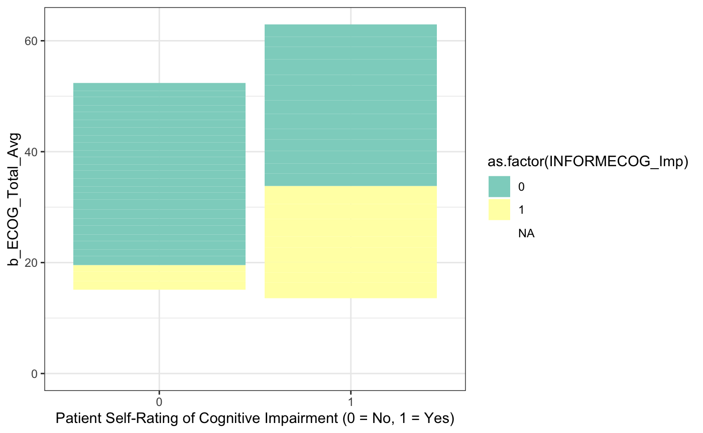 We can see that more patients self-rate as
cognitive impaired than not and, of those who self-rate as impaired,
about half of the related study partners also rate patients as
cognitively impaired. This suggests that, although there is a higher
rate of agreement between patients and study partners when patients
self-rate as not cognitively impaired, there is a much higher rate of
disagreement between raters when patients perceive themselves as
cognitively impaired.

``` r
outcome_var_freq(df_epa)
```

    ##         INFORMECOG_Imp
    ## ECOG_Imp  0  1
    ##        0 24  3
    ##        1 13  8

By comparing how many patients vs study partners rate patient cognition
with a table, we can also calculate exact percentages of impairment and
disagreement across the groups. of the 48 participants included in this
sample, 44% self-rate as impaired while 23% of study partners rate
patients as cognitively impaired (6% of study partners rate patients as
impaired while patients do not and 27% of patients self-rate as impaired
while study partners do not).

We can also take a look at how objective cognition is distributed across
the sample for comparison.

``` r
barplot_oc_imp(df_epa)
```

<!-- -->

``` r
sum(df_epa$ECOG_Imp == 1)
```

    ## [1] 26

``` r
table(df_epa$CogScore)
```

    ## 
    ##  0  1  2  3  4  6 
    ## 34 11  9  4  4  2

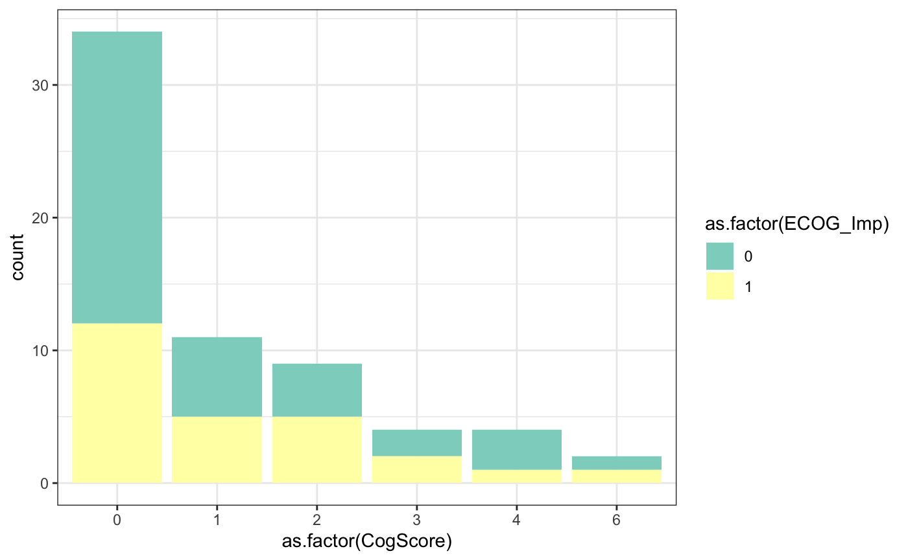 Most patients have no impaired cognitive tests,
although about a third of those with no impaired cognitive tests still
self-rate as cognitively impaired. 26 patients self-rate as cognitively
impaired (41% of n = 64 full sample), but 56% have no impaired cognitive
tests.

Let’s also take a look at the correlation between both patient and study
partner ECog versions.

``` r
cor(df_epa$b_ECOG_Total_Avg, df_epa$b_Informant_ECOG_Total_Avg, use = "pair", method = "pearson") 
```

    ## [1] 0.5346785

``` r
t.test(df_epa$b_ECOG_Total_Avg, df_epa$b_Informant_ECOG_Total_Avg, paired = TRUE) 
```

    ## 
    ##  Paired t-test
    ## 
    ## data:  df_epa$b_ECOG_Total_Avg and df_epa$b_Informant_ECOG_Total_Avg
    ## t = 3.4295, df = 47, p-value = 0.001268
    ## alternative hypothesis: true difference in means is not equal to 0
    ## 95 percent confidence interval:
    ##  0.1129095 0.4333405
    ## sample estimates:
    ## mean of the differences 
    ##                0.273125

We can also compare it to the 30 Month follow-up scores for additional
context.

``` r
cor(df_30M$c30M_ECOG_Total_Avg, df_30M$c30M_Informant_ECOG_Total_Avg, use = "pair", method = "pearson")
```

    ## [1] 0.1978965

``` r
t.test(df_30M$c30M_ECOG_Total_Avg, df_30M$c30M_Informant_ECOG_Total_Avg, paired = TRUE) 
```

    ## 
    ##  Paired t-test
    ## 
    ## data:  df_30M$c30M_ECOG_Total_Avg and df_30M$c30M_Informant_ECOG_Total_Avg
    ## t = -1.8652, df = 161, p-value = 0.06398
    ## alternative hypothesis: true difference in means is not equal to 0
    ## 95 percent confidence interval:
    ##  -0.257094261  0.007341175
    ## sample estimates:
    ## mean of the differences 
    ##              -0.1248765

Let’s devise a heatmap of all continuous variable correlations.

``` r
heatmap_all_vars(df_epa)
```

<!-- --> 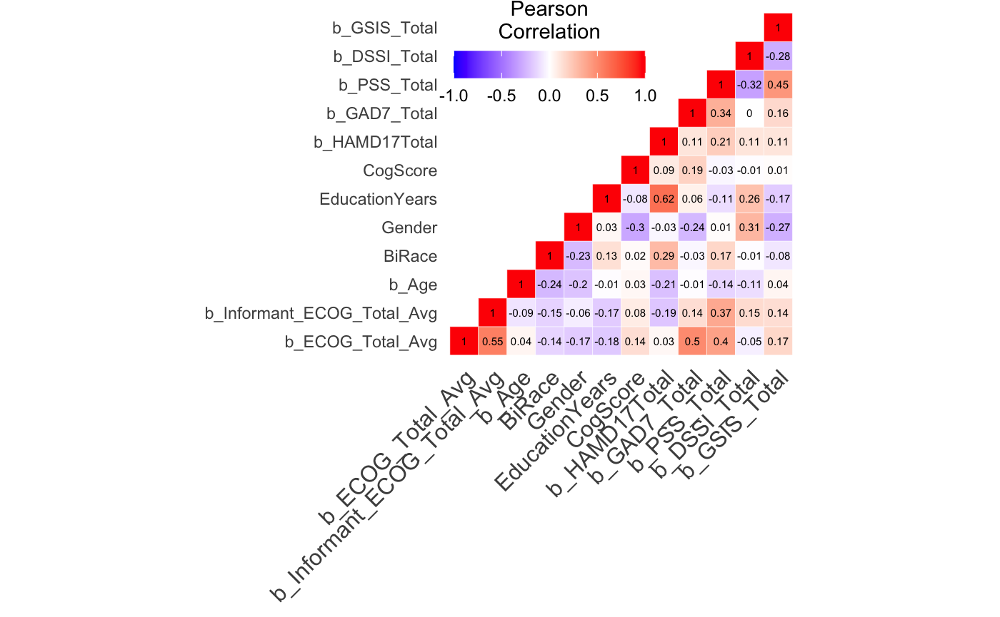

We’ll also check for multicollinearity, as this could potentially
undermine our linear regressions later on.

``` r
collinear_check(df_epa)
```

    ## [1] 0

There are no variables meeting this criteria, so we’ll also check for
linear dependencies.

``` r
df_no_nas <- remove_missing(df_epa)
```

    ## Warning: Removed 20 rows containing missing values.

``` r
comboInfo <- caret::findLinearCombos(df_no_nas)
comboInfo
```

    ## $linearCombos
    ## list()
    ## 
    ## $remove
    ## NULL

Finally, let’s move onto univariate analysis and check out how each
variable is distributed.

``` r
variable_dists(df_epa, df_epa$b_HAMD17Total)
```

    ## `geom_smooth()` using formula 'y ~ x'
    ## `geom_smooth()` using formula 'y ~ x'

    ## Warning: Removed 16 rows containing non-finite values (stat_smooth).

    ## Warning: Removed 16 rows containing missing values (geom_point).

<!-- -->

``` r
summary(df_epa$b_HAMD17Total)
```

    ##    Min. 1st Qu.  Median    Mean 3rd Qu.    Max. 
    ##   15.00   16.75   19.00   20.06   22.25   29.00

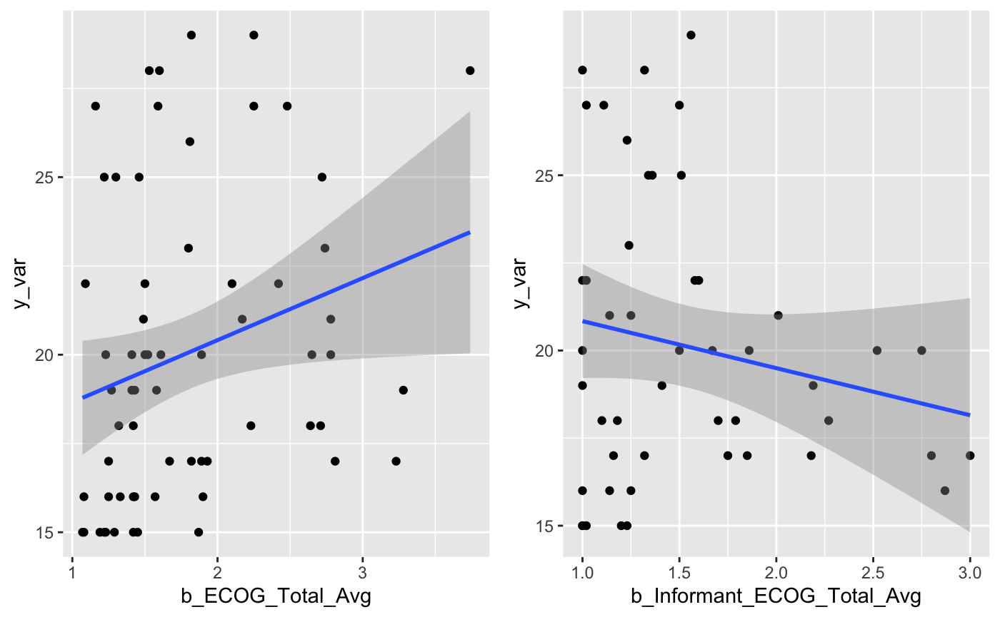

``` r
variable_dists(df_epa, df_epa$b_GSIS_Total)
```

    ## `geom_smooth()` using formula 'y ~ x'

    ## Warning: Removed 5 rows containing non-finite values (stat_smooth).

    ## Warning: Removed 5 rows containing missing values (geom_point).

    ## `geom_smooth()` using formula 'y ~ x'

    ## Warning: Removed 20 rows containing non-finite values (stat_smooth).

    ## Warning: Removed 20 rows containing missing values (geom_point).

<!-- -->

``` r
summary(df_epa$b_GSIS_Total)
```

    ##    Min. 1st Qu.  Median    Mean 3rd Qu.    Max.    NA's 
    ##   38.00   59.50   74.00   72.88   87.50  123.00       5

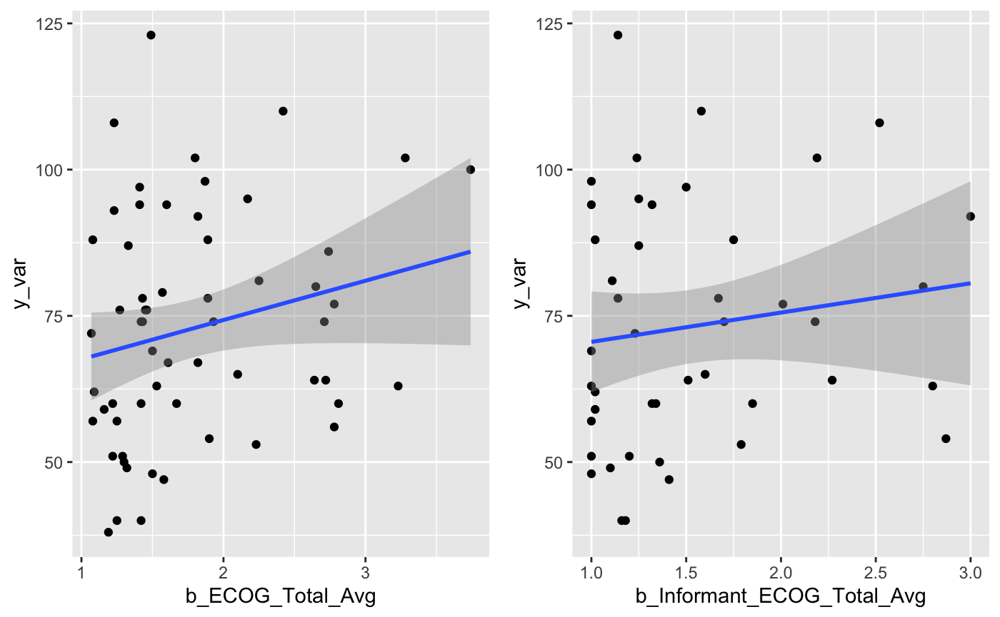

``` r
variable_dists(df_epa, df_epa$b_GAD7_Total)
```

    ## `geom_smooth()` using formula 'y ~ x'
    ## `geom_smooth()` using formula 'y ~ x'

    ## Warning: Removed 16 rows containing non-finite values (stat_smooth).

    ## Warning: Removed 16 rows containing missing values (geom_point).

<!-- -->

``` r
summary(df_epa$b_GAD7_Total)
```

    ##    Min. 1st Qu.  Median    Mean 3rd Qu.    Max. 
    ##    1.00    7.75   10.00   10.41   13.00   21.00

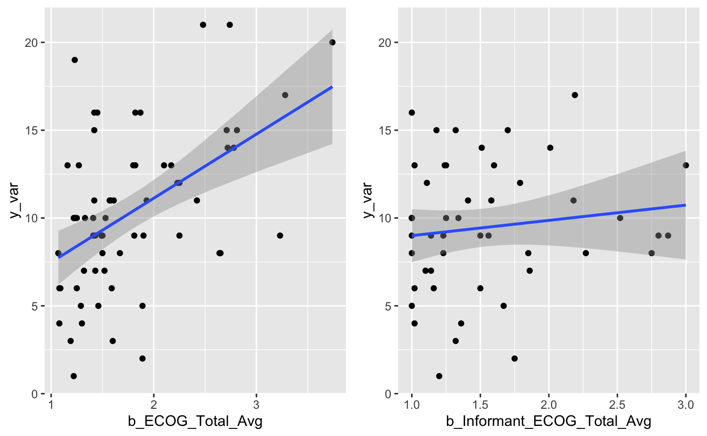

``` r
variable_dists(df_epa, df_epa$b_PSS_Total)
```

    ## `geom_smooth()` using formula 'y ~ x'
    ## `geom_smooth()` using formula 'y ~ x'

    ## Warning: Removed 16 rows containing non-finite values (stat_smooth).

    ## Warning: Removed 16 rows containing missing values (geom_point).

<!-- -->

``` r
summary(df_epa$b_PSS_Total)
```

    ##    Min. 1st Qu.  Median    Mean 3rd Qu.    Max. 
    ##    8.00   19.00   24.00   22.78   27.00   33.00

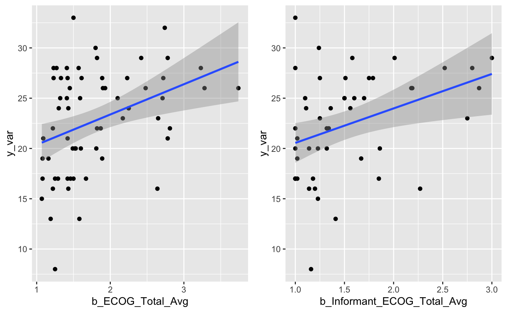

``` r
variable_dists(df_epa, df_epa$CogScore)
```

    ## `geom_smooth()` using formula 'y ~ x'
    ## `geom_smooth()` using formula 'y ~ x'

    ## Warning: Removed 16 rows containing non-finite values (stat_smooth).

    ## Warning: Removed 16 rows containing missing values (geom_point).

<!-- -->

``` r
summary(df_epa$CogScore)
```

    ##    Min. 1st Qu.  Median    Mean 3rd Qu.    Max. 
    ##   0.000   0.000   0.000   1.078   2.000   6.000

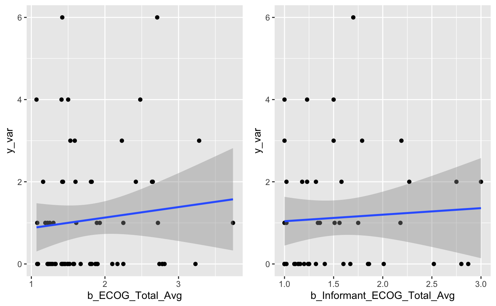

``` r
variable_dists(df_epa, df_epa$b_DSSI_Total)
```

    ## `geom_smooth()` using formula 'y ~ x'
    ## `geom_smooth()` using formula 'y ~ x'

    ## Warning: Removed 16 rows containing non-finite values (stat_smooth).

    ## Warning: Removed 16 rows containing missing values (geom_point).

<!-- -->

``` r
summary(df_epa$b_DSSI_Total)
```

    ##    Min. 1st Qu.  Median    Mean 3rd Qu.    Max. 
    ##   17.00   27.75   35.00   36.95   45.50   76.00

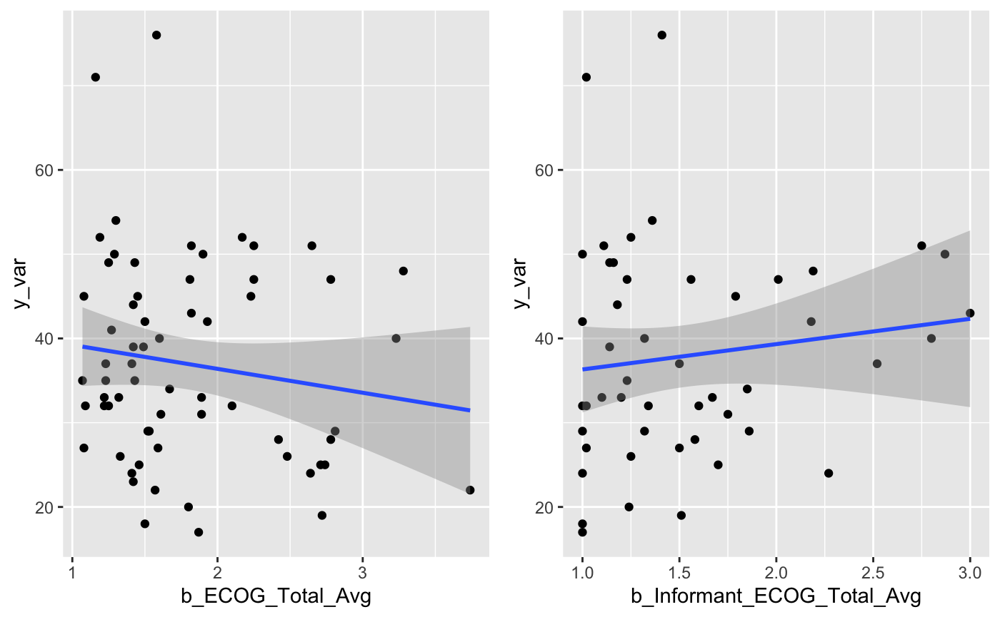

``` r
variable_dists(df_epa, df_epa$b_Age)
```

    ## `geom_smooth()` using formula 'y ~ x'
    ## `geom_smooth()` using formula 'y ~ x'

    ## Warning: Removed 16 rows containing non-finite values (stat_smooth).

    ## Warning: Removed 16 rows containing missing values (geom_point).

<!-- -->

``` r
summary(df_epa$b_Age)
```

    ##    Min. 1st Qu.  Median    Mean 3rd Qu.    Max. 
    ##   65.00   67.00   69.00   70.20   71.25   88.00

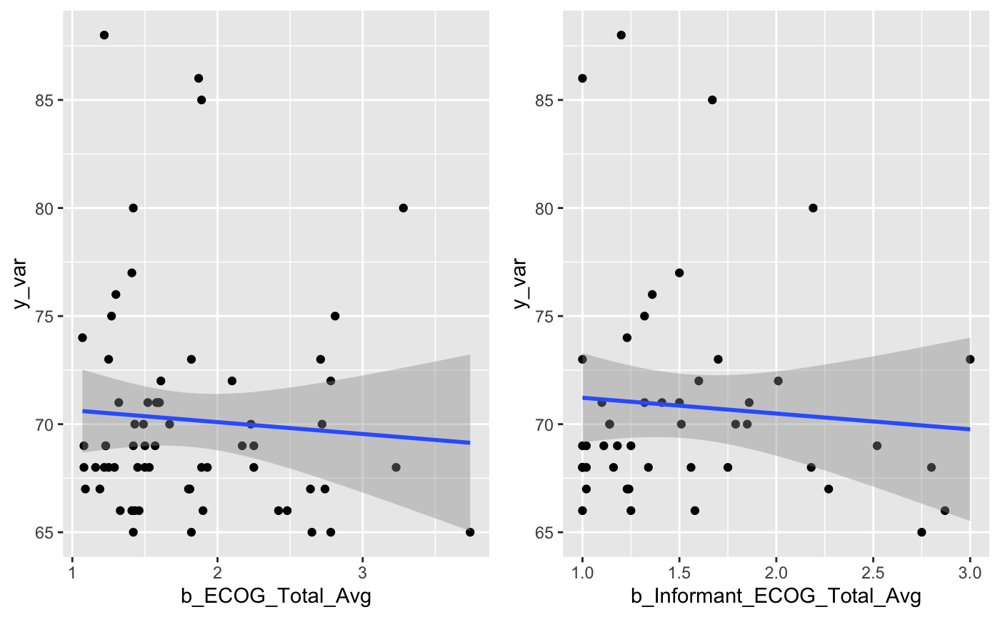

``` r
variable_dists(df_epa, df_epa$EducationYears)
```

    ## `geom_smooth()` using formula 'y ~ x'
    ## `geom_smooth()` using formula 'y ~ x'

    ## Warning: Removed 16 rows containing non-finite values (stat_smooth).

    ## Warning: Removed 16 rows containing missing values (geom_point).

<!-- -->

``` r
summary(df_epa$EducationYears)
```

    ##    Min. 1st Qu.  Median    Mean 3rd Qu.    Max. 
    ##   12.00   16.00   18.00   18.75   20.00   28.00

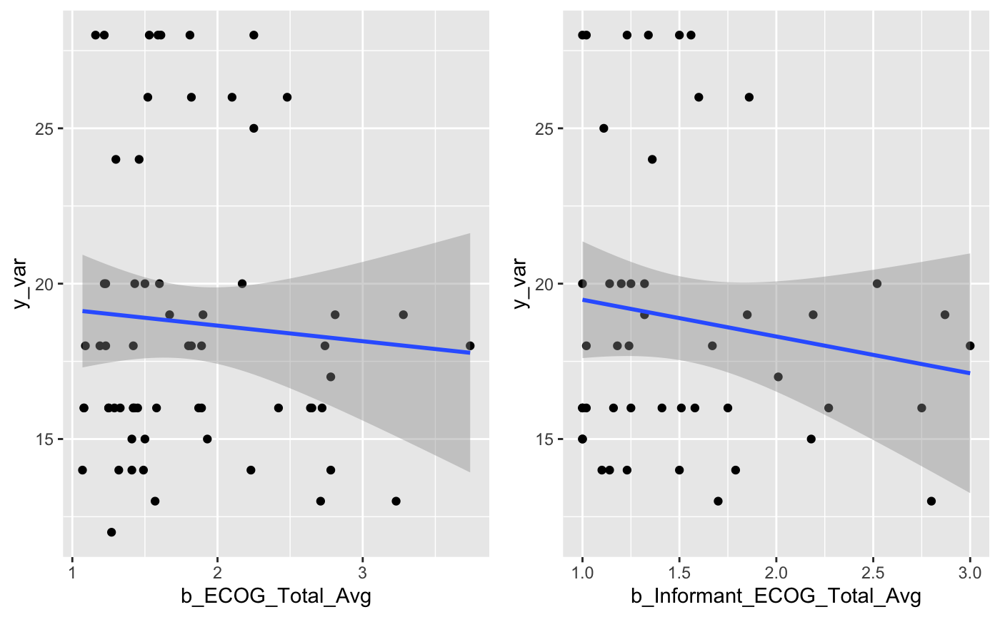
